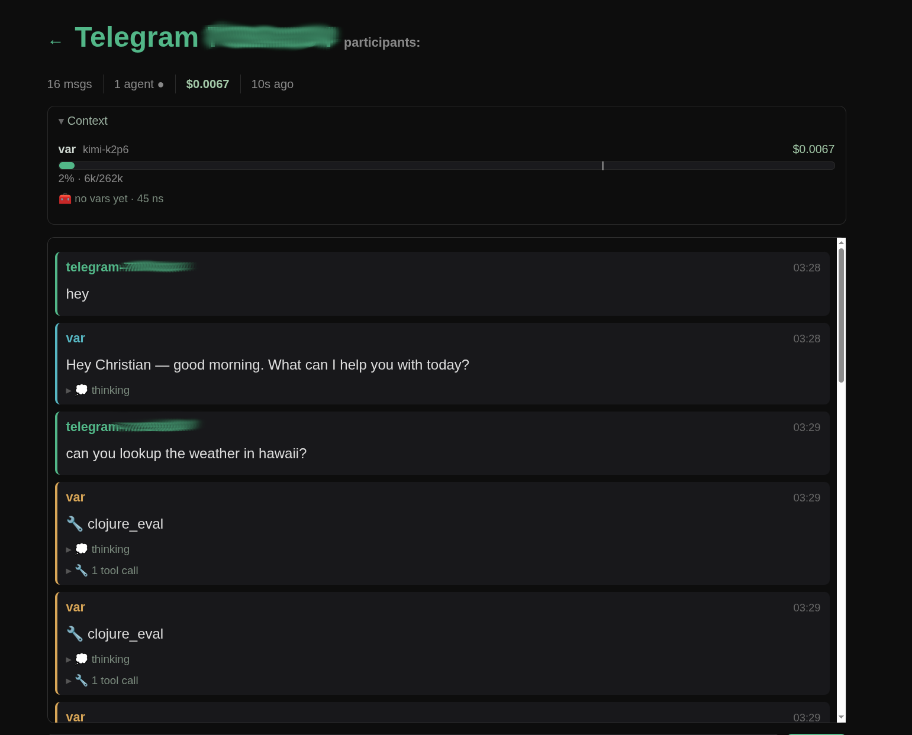
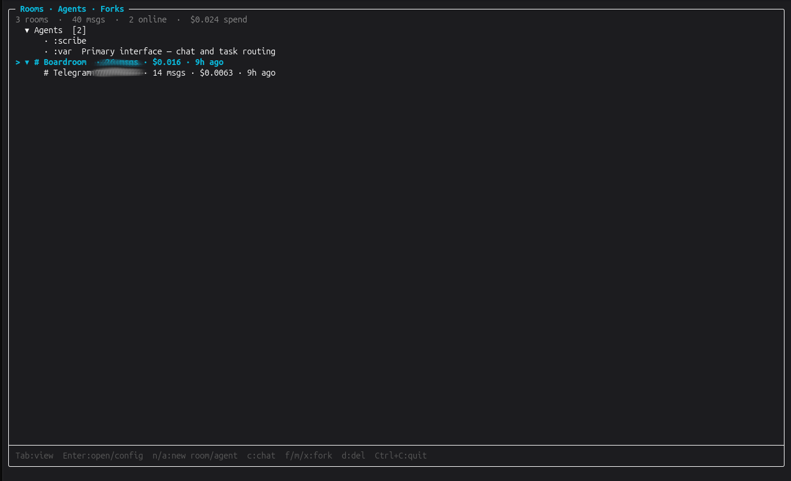

# ⚒️ dvergr

[](https://clojars.org/org.replikativ/dvergr)
[](https://circleci.com/gh/replikativ/dvergr)
[](https://clojurians.slack.com/archives/C09622F337D)
[](https://replikativ.github.io/dvergr/)

**An FRP programming model for agents, in a discourse framework.** Agents are
reactive processes in continuous-time rooms; humans, LLMs, and scripts are
participants in the same shape, composing through tagged messages on a small
pub/sub kernel.

You **program agents** and **compose them into multi-agent workflows**. And because
agents run in the same live medium they're built from, an agent **can** even begin to
compose workflows itself, in a forked world you review — *early and exploratory, not
the default mode*.

Built on [Spindel](https://github.com/replikativ/spindel) (functional
reactive runtime), [Datahike](https://github.com/replikativ/datahike)
(immutable Datalog), and
[Yggdrasil](https://github.com/replikativ/yggdrasil)
(copy-on-write branching across git + database).

## What it gives you

**A programming model for multi-agent systems:**

- 💬 **Discourse rooms** — humans + LLM agents exchange messages as equal participants
- 🏷️ **Tagged routing** — agents escalate `:escalation/budget`, policy-bots
  subscribe by capability tag; neither hardcodes the other
- 🌿 **Substrate forks** — a "what would the coder write?" probe runs on a
  branched git worktree + datahike, then merges or discards atomically
- 🧩 **Compositional kernel** — five primitives (tagged message, capability sub,
  dynamic subscribe, fork-room, GenerationHandle) cover the whole programming surface

**…and a batteries-included substrate to run agents on:**

- 🧪 **`clojure_eval` — a safe code sandbox** — the agent's main programming surface:
  Clojure eval in an isolated **SCI** context wired to the dvergr world (rooms,
  knowledge, intake), with new dependencies loaded through a human-approval gate
- 📦 **A real workspace it owns** — each room clones the
  [dvergr-sandbox](https://github.com/replikativ/dvergr-sandbox) stdlib into its own
  git repo; the agent `require`s, edits, and `git commit`s its own code there, and the
  workspace forks/merges with the room
- 🛠️ **A curated toolset around it** — structured read/write/edit, structural
  Clojure edit, a test runner, and a **jailed `muschel` shell** (parsed +
  filesystem-sandboxed, not raw `bash -c`)
- 📡 **~25 intake sources** — read-only data feeds (Hacker News, Reddit, RSS,
  web / YouTube / tweet fetch, mail, SEC-EDGAR, GitHub, …) ship as **editable source in
  the workspace** — the agent reads, copies, and extends them — pulling into a Datahike
  knowledge graph
- 🔐 **Boundary credential handling** — intakes that need an API key get a *placeholder*
  in the sandbox; the gated HTTP egress swaps in the real key only at the bound domain
  and scrubs it from the response, so **the agent uses keys it never sees** ([design](doc/boundary-secret-injection.md))
- 🔌 **Multiple LLM providers** — Anthropic (incl. the local `claude` CLI, zero-key),
  OpenAI, Fireworks, or any OpenAI-compatible endpoint — swappable per agent
- 🪙 **Budgets & accounting** — every turn is metered in microdollars against a
  per-agent budget; an agent hits a checkpoint and can escalate `:directive/raise-budget`
  for more, with all spend recorded in a ledger — so cost stays bounded
- 🧠 **Context management** — long runs auto-prune tool outputs and summarize older
  turns as the model's window fills, so an agent holds a long conversation without
  overflowing context
- 💾 **Persistent + multi-frontend** — rooms, history, and knowledge persist in
  Datahike; drive the same daemon from the TUI, the web dashboard, Telegram, or nREPL
- 🔁 **Self-programming substrate** — agents operate in the same SCI/FRP world they're
  built from, so an agent *can* spawn agents and wire workflows in a fork, gated by your
  `merge` and bounded by budgets. *(An early capability we're exploring — not the default mode.)*

## See it

| Web dashboard | Terminal UI |
|:---:|:---:|
| [](doc/img/web.png) | [](doc/img/tui.png) |

A room with its agents, live token cost, and collapsible thinking/tool activity —
the same rooms, in the browser or the terminal.

## 60-second quickstart

```bash
git clone https://github.com/replikativ/dvergr.git
cd dvergr
clojure -M:cli                 # daemon + nREPL(:7888) + TUI chat
```

Pick a provider by exporting its API key (or set it in `config.local.edn`):

```bash
# Anthropic — or zero-key via the local `claude` CLI (auto-detected on PATH,
# no key needed with a Claude Code subscription)
export ANTHROPIC_API_KEY=sk-ant-...

# OpenAI, or any OpenAI-compatible endpoint
export OPENAI_API_KEY=sk-...
export OPENAI_BASE_URL=https://api.openai.com/v1     # optional; override for compatibles

# Fireworks (OpenAI-compatible; the bundled model registry is Fireworks)
export FIREWORKS_API_KEY=fw-...
```

> The shipped default config leaves the agent's provider **unpinned**, so it
> auto-selects the best provider you have a key for (preference: Anthropic →
> Fireworks → OpenAI → the local `claude` CLI) and its default model. **Set any
> one of the keys above and it works** — you don't have to match a specific
> provider. Pin `:provider`/`:model` in `config.local.edn` to force one. If no
> provider key is set at all, the daemon still boots but logs a warning and agent
> turns fail at call time.

Copy [`config.example.edn`](config.example.edn) → `config.local.edn` (gitignored)
to set the default model, agents, and a Telegram bot token — see
[`doc/configuration.md`](doc/configuration.md) and
[provider setup](doc/provider-setup.md).

Type a message, press **Enter**; **Ctrl-C** quits. Rooms + history persist
automatically (Datahike). Frontends are interchangeable over the one daemon:

```bash
clojure -M:cli                 # daemon + nREPL(:7888) + TUI
clojure -M:cli --no-tui --web  # server box: daemon + nREPL + web dashboard (127.0.0.1:17880)
```

**Standalone uberjar** — one file with daemon + nREPL + TUI + web + Telegram.
CircleCI builds it on every push to `main` and attaches it to a GitHub release,
so you can grab the prebuilt jar from the
[latest release](https://github.com/replikativ/dvergr/releases/latest) — or build
it yourself:

```bash
clojure -T:build harness            # → target/dvergr-<ver>-harness.jar
java -jar dvergr-<ver>-harness.jar  # run it
```

## REPL quickstart

```clojure
(require '[dvergr.core :as d])

;; Build a room and join a coder agent
(def room (d/room :scratch))
(binding [org.replikativ.spindel.engine.core/*execution-context* (:ctx room)]
  (d/join room (d/coder {:id :coder})))

;; Send a user message; the agent replies asynchronously
(d/post! room (d/message :you :coder "Add input validation to src/app.clj"))

;; Read the message log
(d/log room)
;; => [{:from :you :to :coder :content "..." :type :user/message}
;;     {:from :coder :to :you :content "..." :type :user/message}
;;     ...]
```

For tagged routing, per-consumer buffer policies, persistence, and the
fork-and-merge proposal pattern, see
[doc/getting-started.md](doc/getting-started.md).

## Documentation

- **[Getting Started](doc/getting-started.md)** — first-room tutorial,
  REPL + CLI paths
- **[Programming Model](doc/programming-model.md)** — bus, tagged
  routing, GenerationHandle, the distributive law λ
- **[CLI Reference](doc/cli.md)** — `dvergr-cli` keys, persistence,
  provider config
- **[Architecture](doc/architecture.md)** — the formal model: rooms,
  the pub/sub bus, agents as reactive processes, ToM via substrate fork
- **[Tools & the SCI sandbox](doc/tools-and-sandbox.md)** — the toolset, the
  workspace agents run code in, and its safety boundaries (incl. credential injection)
- **[Doc index](doc/README.md)** — full table of contents

## Example notebooks

Literate, live-running [Clay](https://scicloj.github.io/clay/) notebooks — each
builds and runs a real room inline. Browse them rendered at
[replikativ.github.io/dvergr](https://replikativ.github.io/dvergr/), or open the
source in your editor. Build locally with `clj -M:clay -m notebooks.render`
(needs the `quarto` CLI).

| Notebook | What it shows |
|----------|---------------|
| [Getting started](notebooks/notebooks/getting_started.clj) | rooms, participants, `post!`, tagged routing — from zero |
| [Programming model](notebooks/notebooks/programming_model.clj) | the compositional kernel: capability subscriptions, escalation, per-consumer buffer/SLA policy |
| [Humans & agents](notebooks/notebooks/humans_and_agents.clj) | humans as participants, background tasks, propose → accept/reject (fork & merge) |
| [Agents & tools](notebooks/notebooks/agents_and_tools.clj) | a real LLM agent, `clojure_eval` as the SCI sandbox, budgets + context compaction |

The standalone, runnable scenarios these import live in [`examples/`](examples/)
(`clj -M:examples -m scenario-auditor`).

## Building blocks

| Namespace | What it provides |
|---|---|
| `dvergr.core` | Public facade — re-exports the most-used vars |
| `dvergr.discourse` | Room, participant, post!, ask, fork-room, merge-room |
| `dvergr.runtime.bus` | Pub/sub routing kernel + opinionated buffer policy table |
| `dvergr.discourse.llm` | `llm-agent` — directive-aware participant |
| `dvergr.discourse.generation` | `GenerationHandle` + sync/future/external/streaming adapters |
| `dvergr.participant.context` | `ParticipantContext` — uniform memory+budget across LLM/human/hybrid |
| `dvergr.discourse.personas` | `researcher`, `coder`, `reviewer` — pre-built agents |
| `dvergr.rooms.forks` | `fork!` / `review` / `merge!` / `discard!` — the fork→review→merge lifecycle behind `spawn_agent`/`propose_change` |
| `dvergr.cli.main` | `-main` of the TUI chat client |

## Provider setup

```clojure
(require '[dvergr.model.providers :as providers])

;; Auto-registers from env: ANTHROPIC_API_KEY, OPENAI_API_KEY, FIREWORKS_API_KEY
(providers/ensure-initialized!)

;; Anthropic via the local `claude` CLI (no API key needed)
;; Auto-detected if `claude` is on PATH.

;; Any OpenAI-compatible provider
(providers/register-openai-compatible!
  :groq
  {:base-url "https://api.groq.com/openai/v1"
   :api-key  (System/getenv "GROQ_API_KEY")})

;; Local model via Ollama
(providers/register-openai-compatible!
  :ollama
  {:base-url "http://localhost:11434/v1"
   :api-key  "ollama"})
```

## Dependencies

| Library | Role |
|---|---|
| [Spindel](https://github.com/replikativ/spindel) | FRP reactive runtime, CoW context forking, pub/sub |
| [Datahike](https://github.com/replikativ/datahike) | Immutable Datalog database (conversation + knowledge) |
| [Yggdrasil](https://github.com/replikativ/yggdrasil) | Copy-on-write branching across git + Datahike |
| [SCI](https://github.com/babashka/sci) | Sandbox for `clojure_eval` and agent code |
| [spindel-tui](https://github.com/replikativ/spindel-tui) | Terminal UI built on JLine + Spindel signals |
| [hato](https://github.com/gnarroway/hato) | HTTP client for provider APIs |
| [Telemere](https://github.com/taoensso/telemere) | Structured logging + observability |

> **SCI fork note (Clojars library consumers only).** dvergr pins a fork of SCI
> (`whilo/sci`, branch `resource-check`) for the `:interrupt-fn` cancellation the
> sandbox relies on, pending an upstream PR. tools.build's `write-pom` emits only
> Maven coords, so this git dep is **not** in the published pom. The uberjar/CLI
> and git-dep consumers get it transitively and need nothing extra; a pure-Clojars
> library consumer must add it themselves:
> ```clojure
> org.babashka/sci {:git/url "https://github.com/whilo/sci"
>                   :git/sha "24762a163ef5b25c692d0e5cd4ea63a5bd6b0a16"}
> ```
> (Goes away once the fork lands upstream or is published to Maven.)

## License

Copyright © 2026 Christian Weilbach. Apache License 2.0 — see [LICENSE](LICENSE).
