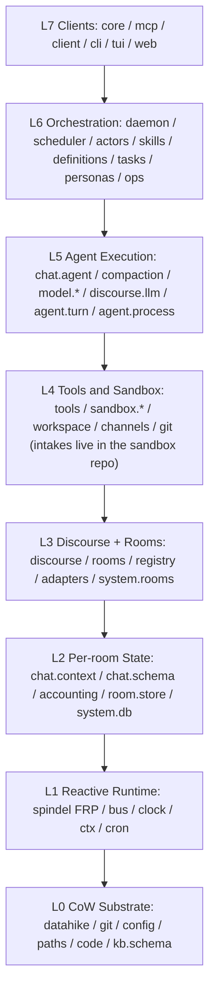
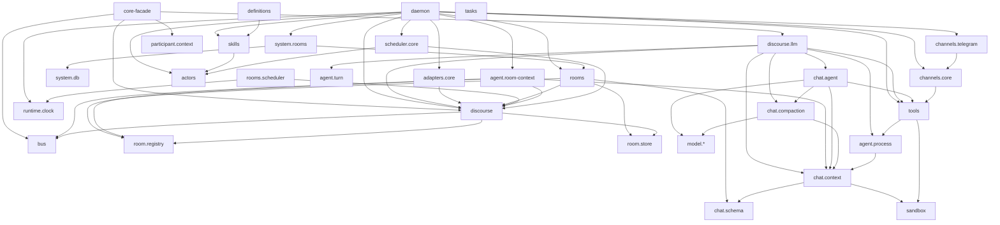
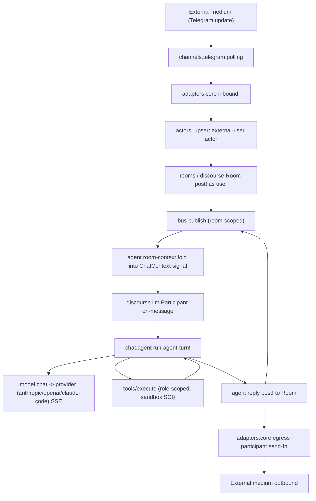

# Dvergr Architecture Map

> A map of the codebase: the layer model, the subsystem dependency graph, the
> inbound message flow, and a per-namespace-family table (~112 namespaces under
> `src/` + `src-clients/`). The exhaustive per-file table was retired in favour of
> the family table below — it stays accurate across refactors.

## Overview

Dvergr is a Clojure AI-agent harness organized as an 8-layer stack (L0–L7) over a
copy-on-write substrate and a reactive (FRP) runtime. The architecture has
converged on **Rooms + Participants on a Bus** as the single discourse model, with
**medium adapters** (`dvergr.adapters.core`) bridging external chat media (Telegram)
into rooms as remote-user actors. A room is a self-contained project (its own git
workspace + Datahike message/knowledge stores); a thin global **system-db**
(`dvergr.system.db`) is only the registry that keeps the set of rooms/agents together.

**Layer summary:**
- **L0 — CoW substrate / persistence**: config loading (`substrate/config`), git
  worktree CoW (`substrate/git`), state-root paths (`substrate/paths`), logging
  (`substrate/log`), the katzen-bound knowledge schema (`kb/schema`), exact-text +
  semantic code parsing (`code`), and per-domain Datahike schema (`scheduler/schema`).
- **L1 — reactive runtime primitives**: spindel ExecutionContext/FRP (external), the
  pub/sub `runtime/bus` + `runtime/peer-bus`, the single reactive `runtime/clock`, the
  CoW execution-context memory model (`runtime/ctx`), and the pure cron math
  (`scheduler/cron`).
- **L2 — per-chat / per-room state**: `chat.context` (signals + Datahike + SCI),
  `chat.schema` (the unified Datahike schema), `chat.accounting` (microdollar budgets),
  `participant.context`, the per-[room,agent] folded ChatContext (`agent/room-context`),
  Room store impls (`room/store/*`), the `system.db` registry, the in-memory code index,
  and analysis queries.
- **L3 — discourse + rooms**: `discourse` core (Room/Participant/Message, fork/merge,
  algebra: ask/fan-out/race/quorum/pipeline), the `room.registry`, `rooms` (CRUD +
  Datahike unification), rooms-as-projects provisioning (`system.rooms`, `system.mail`),
  reactive room views (`rooms/messages`, `rooms/tree`, `rooms/stats`, `rooms/forks`), the
  per-room reactive scheduler (`rooms/scheduler`), and the transport-agnostic `adapters/core`.
- **L4 — tools + sandbox**: the `tools` registry/executor, the SCI sandbox (`sandbox` +
  `sandbox/ns/*` injectors + `sandbox/workspace` load-root + gated `sandbox/deps`),
  structural/analyzer code-edit utilities, the channels framework, and git worktree
  management. **The read-only intake data sources are no longer in dvergr's source** —
  they live as agent-editable Clojure in the
  [dvergr-sandbox](https://github.com/replikativ/dvergr-sandbox) stdlib repo, cloned into
  each room's workspace; only `intake/bash` (the muschel shell) and `intake/mail` remain
  in-tree.
- **L5 — agent execution**: the turn loop (`chat/agent`), context compaction, model
  abstraction (`model/*` + provider impls for Anthropic/OpenAI/Claude-Code), the
  LLM-backed participant factory (`discourse/llm`), the shared turn mechanics
  (`agent/turn`), the system-prompt assembler (`agent/prompt`), and process
  checkpoint/resume (`agent/process`).
- **L6 — orchestration**: the `daemon` (still a large monolith — turn loop + session
  handling + Telegram adapter + evaluator inlined), the `scheduler`, actors + transport,
  skills + the unified `definitions` loader, tasks, stats, personas, workflows, the
  central `ops` spec, and the Telegram channel.
- **L7 — clients**: the `core` facade, MCP server/json-rpc, the nREPL `client`, the CLI
  entry point, the TUI app, and the web dashboard/API.

**Key cross-cutting threads.** Spindel's ExecutionContext is the spine: rooms,
schedules, the peer-bus, and stats all live as ctx-local state under `[:dvergr/*]`
paths. CoW forking — of rooms, sub-chats, and git worktrees — underpins the
fork/review/merge lifecycle (`rooms/forks` + the `spawn_agent`/`propose_change` tools).

The largest remaining structural debt:

- the `daemon` monolith (inlined turn loop + session handling + Telegram adapter + evaluator);
- `channels/telegram`, still partly on the old dispatch path rather than `adapters/core`;
- residual `:status :online` presence assumptions in `skills`/`stats` that pre-date the
  resolved "presence = room membership" model.

## Diagrams

### Layer Stack L0–L7

### Subsystem Dependency Graph

### Inbound Message Flow (medium → model → tools)

## Per-namespace-family layout

| family | layer | role |
|--------|-------|------|
| `substrate/{config,git,log,paths}` | L0 | EDN config load/cache; git worktree CoW; structured logging; `.dvergr/` state-root resolution |
| `code` + `code/index` | L0/L2 | Clojure source parse/diff + in-memory katzen ACSet code index |
| `kb/schema` | L0 | Knowledge-base schema (katzen canonical → Datahike idents) |
| `scheduler/{schema,cron,core,tools}` | L0–L6 | persistent-schedule schema; pure cron math; spindel-native scheduler; agent schedule tools |
| `runtime/{bus,peer_bus,clock,ctx}` | L1 | pub/sub substrate; control-plane peer-bus; the single reactive clock; CoW execution-context memory model |
| `chat/{context,schema,accounting,compaction,agent,tool_schema}` | L2/L5 | per-chat signals+Datahike state; the unified schema; budgets; compaction; the core turn loop; tool→schema gen |
| `participant/context` | L2 | uniform participant context (LLM/human/hybrid) |
| `agent/room_context` | L2 | per-[room,agent] long-lived ChatContext folded from the room bus |
| `system/{db,rooms,mail}` | L2/L3 | the global system-db registry (identity backbone); rooms-as-projects provisioning/resolvers; attach a briefkasten mailbox as a ygg system |
| `room/{registry,store,store/datahike,store/memory}` | L2/L3 | slug↔Room registry; PRoomStore protocol + Datahike/in-memory impls |
| `discourse` (core) | L3 | Room/Participant/Message, fork/merge, algebra combinators |
| `discourse/{background,enrichment,human,commands,personas,workflows,definitions}` | L3/L6 | background spawner; on-message decorators; human participant; slash-command registry; pre-built personas; workflow patterns; the unified skill+agent-identity loader |
| `discourse/{llm,generation}` | L4/L5 | LLM participant factory; GenerationHandle bridge |
| `rooms` + `rooms/{forks,messages,tree,stats,theme,scheduler}` | L3 | room CRUD + Datahike unification; fork describe/review/merge/discard; signal-backed transcript/tree/stats views; per-speaker theme; per-room reactive scheduler |
| `adapters/core` | L3 | transport-agnostic medium adapter: inbound posting + egress Participant |
| `tools` + `tools/{structural,code_analyzer,dependency_search,llm_call,approval}` | L4 | tool registry/executor (role-scoped); structural/analyzer edits; dependency search; one-shot LLM tool; approval workflow |
| `sandbox` + `sandbox/{deps,workspace}` + `sandbox/ns/*` | L4 | SCI runtime (ctx/eval/limits); gated add-libs; the workspace load-root; the injected namespaces (`io`/`data`/`datahike`/`agent`/`kb`/`room`/`mail`/`codec`/`dev`/`intake`) |
| `intake/{bash,mail}` | L4 | the only in-tree intakes — muschel-jailed shell + briefkasten mail (all other data sources live in the dvergr-sandbox stdlib repo) |
| `channels/{core,telegram,telegram_commands,telegram_send}` | L4/L6 | channel framework; Telegram Bot API (polling/old dispatch); `dvergr.ops` slash-command binding; outbound Markdown→HTML rendering + chunking |
| `model/{provider,providers,registry,chat,quirks}` + `model/api/{anthropic,openai,claude_code}` | L5 | provider protocol + registry + metadata; streaming chat over SSE; provider quirks; the three provider impls |
| `agent/{turn,prompt,process,tool_commands,persona,ops,fields}` | L5/L6 | shared turn mechanics; system-prompt assembler; checkpoint/resume process; tool commands; persona resolution; agent-management ops + field spec |
| `orchestration/{daemon,skills,tasks,stats}` | L6 | the runtime daemon (lifecycle/registry/turn loop/sessions/Telegram); skill registry; task ledger; stats cache |
| `actors` + `actors/transport` | L6 | durable actor identity table; PActorTransport impls |
| `ops` | L6 | central operations spec — one data map; web/MCP/Telegram surfaces derived (datahike-spec pattern) |
| `security/allowlist` | L6 | Telegram user allowlist access control |
| `analysis/{queries,coverage}` | L2/L6 | Datalog extraction helpers; heuristic test-coverage analysis |
| `core` | L7 | public API facade (re-exports discourse/llm/personas/bus) |
| `mcp/{server,json_rpc}` | L7 | TCP/stdio MCP server + JSON-RPC/MCP dispatch |
| `clients/client` | L7 | nREPL client — inspect/interact + fork-task workflow over a daemon |
| `cli/main` + `tui/app` (src-clients) | L7 | CLI entry point; the TUI app (a rich medium adapter onto rooms) |
| `web/{server,dashboard,api,ops,agents}` | L7 | http-kit server; dashboard (hiccup+HTMX); spec-derived JSON API; web `ops` binding; agent config UI |
| `experimental/distributed` | cross | EXPERIMENTAL Kabel remote-peer bridge (not release-wired) |
